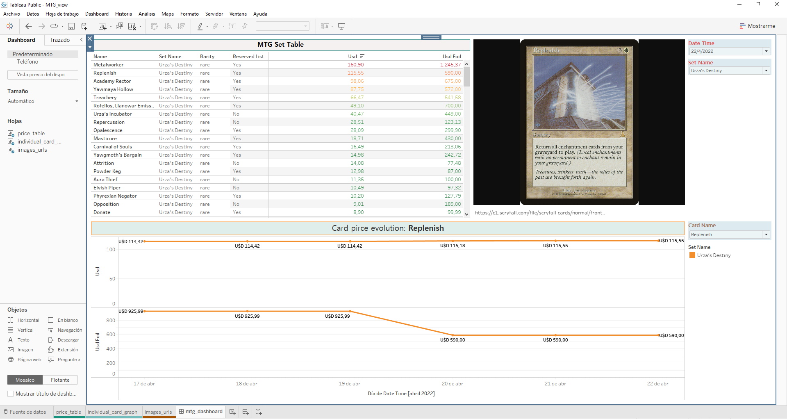

# Magic The Gathering Price Analytics

## Brief Description

The idea behind this project is to fetch Magic The Gathering cards information (name, set, rarity, current market price, etc), sotre it and ran some code to present/analyze it.

## How to use it

This will discribe how I did the setup and the configuration. By any means is tested in multiple OS and/or versions. It's just the way I solved things for my local Windows computer. Also take in mind that I'm not uploading the venv (virtual environment) for this project. This should be created and configurated in each case.
With that in consideration, to use this you should do the following:

1. Have Python installed.
2. Install JupyterLab.
3. Create a virtual env in the folder to which you copy this repository to (py -m venv <name_for_my_env>).
4. Activate the virtual env in the folder to which you copy this repository to (.\<name_for_my_env>\Scripts\activate).
	* Install Node.js in you computer(the reason for this is that once you install jupyter-dash is necessay to be able to build jupyter <it needs to in order to make full ussage of the library>).
	* Install the following python libreries to the virtual env:
		* pandas
		* dash
		* jupyter-dash (to be able to run dash on JupyterLab)
		* jupyterlab "ipywidgets>=7.5” (to be able to run Plotly inside JupyterLab)

Also is important to start jupyterlab from the directory location and with the environment active first.

## Information Visualization

A part from the dash interactive visualizations and plots I did a `Tableau version` (I believe that for this things is a little bit more powerful),
so you can see a tsate of the information. The link can be found below:

https://public.tableau.com/views/MTG_view/mtg_dashboard?:language=es-ES&:display_count=n&:origin=viz_share_link

An example of the Tableau Dashboard can be seen in the following image:

  

## Credits and Links

	